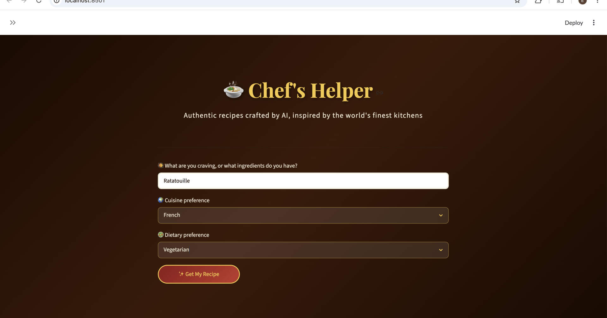

# 🍲 Chef's Helper — AI-Powered Recipe Assistant

## 🎥 Demo

Chef's Helper in action — enter what you're craving or the ingredients you have, pick a cuisine and dietary preference, and get an AI-generated recipe instantly.



*From prompt to plated recipe: Chef's Helper takes your ingredients and preferences and generates a full recipe — including chef's tips — in seconds.*

> CAP 942 Capstone Project | Per Scholas AI Solutions Developer Program 2026
> Submitted by: Elvis Obinna Onya

---

## What It Does

Chef's Helper is an AI-powered recipe assistant that takes your craving, cuisine preference, and dietary needs and returns a complete authentic recipe — generated by a locally running open-source LLM. No paid APIs. No internet required. Runs entirely on your machine.

---

## Features

- Natural language recipe requests ("I want jollof rice" or "I have chicken and plantains")
- Cuisine preference selector (West African, Caribbean, Mediterranean, Asian, Latin American)
- Dietary notes support (halal, vegetarian, nut-free, dairy-free, etc.)
- Full recipe output: name, ingredients, step-by-step instructions, chef tip
- Save favorite recipes to a local JSON database
- Sidebar showing all saved recipes
- Custom chef-themed UI with dark warm design

---

## Tech Stack

| Component | Tool |
|---|---|
| LLM Runtime | Ollama 0.30.4 |
| LLM Model | Meta Llama 3 (8B) |
| UI Framework | Streamlit 1.58 |
| Language | Python 3.11 |
| Package Manager | UV 0.11.18 |
| Data Storage | favorites.json |

---

## How to Run

### Prerequisites
- Mac or Linux machine
- [Ollama](https://ollama.com) installed
- [UV](https://astral.sh/uv) installed
- Python 3.10 or higher

### Step 1 — Clone the repo
```bash
git clone https://github.com/onyelv/Elvis_Onya_CapstoneAI.git
cd Elvis_Onya_CapstoneAI
```

### Step 2 — Pull the LLM model
```bash
ollama pull llama3
```

### Step 3 — Install dependencies
```bash
uv sync
```

### Step 4 — Start Ollama
```bash
ollama serve
```

### Step 5 — Run the app
Open a new terminal tab and run:
```bash
uv run streamlit run app.py
```

The app will open at `http://localhost:8501`

---

## Project Structure